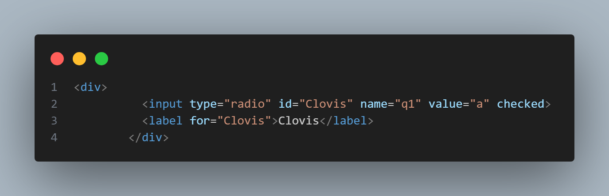

# CREATION D'UN QUIZZ AVEC UDEMY

Toutes les vérifications en temps réel se feront ici grâce à l'extension "live server" de VSCode. 

J'essaierai plus tard de faire différemment grâce à NodeJS.

## Utilisation de label for

Le fait d'avoir mis "Clovis" en id ET dans "label for =" permet une meilleure accessibilité car ça permet de cocher la case en cliquant sur le nom et pas seulement sur la case.
Le "checked" à la fin permet d'avoir la case cochée par défaut.
"name q1" permet de réunir tous les différents boutons radio avec le même name, ce sera plus simple à retrouver en JS.
<!-- ## Ajout d'emojis  -->

# Ressources utilisées : 
- IDE utilisé : VSCode
- Cours Udemy 20 projets en JS
- https://emojipedia.org/ pour récupérer les emojis